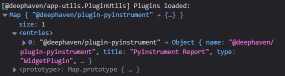
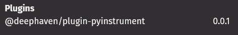

# Deephaven Pyinstrument Plugin

This is a plugin for Deephaven that displays [pyinstrument](https://github.com/joerick/pyinstrument) profiling reports.

## Plugin Structure

The `src` directory contains the Python and JavaScript code for the plugin.
Within the `src` directory, the `deephaven/plugin/pyinstrument` directory contains the Python code, and the `js` directory contains the JavaScript code.

The Python files have the following structure:
`pyinstrument_object.py` defines `PyinstrumentReport`, a wrapper around the HTML produced by a pyinstrument `Profiler`, along with the `profile` decorator and `PyinstrumentReport.profile_context` helpers used to capture a report.
`pyinstrument_type.py` defines `PyinstrumentType`, a fetch-only object type that registers `PyinstrumentReport` with Deephaven and serializes its HTML to the client.
`_register.py` registers the Python type and the JavaScript plugin with Deephaven under the `deephaven.plugin.pyinstrument` namespace.

The JavaScript files have the following structure:
`PyinstrumentPlugin.ts` registers a widget plugin with Deephaven for the `pyinstrument.Report` type. The `supportedTypes` value here must match the `name` returned by `PyinstrumentType` in `pyinstrument_type.py`, and these should be kept in sync.
`PyinstrumentView.tsx` defines the plugin panel. It fetches the report's HTML and renders it inside a sandboxed `iframe`.

## Using plugin_builder.py
The `plugin_builder.py` script is the recommended way to build the plugin.
See [Building the Plugin](#building-the-plugin) for more information if you want to build the plugin manually instead.

To use `plugin_builder.py`, first set up your Python environment and install the required packages.
To build the plugin, you will need `npm` and `python` installed, as well as the `build` package for Python.
`nvm` is also strongly recommended, and an `.nvmrc` file is included in the project.
The script uses `watchdog` and `deephaven-server` for `--watch` mode and `--server` mode, respectively.
```sh
cd pyinstrument-plugin
python -m venv .venv
source .venv/bin/activate
cd src/js
nvm install
npm install
cd ../..
pip install --upgrade -r requirements.txt
pip install deephaven-server watchdog
```

First, run an initial install of the plugin:
This builds and installs the full plugin, including the JavaScript code.
```sh
python plugin_builder.py --install --js
```

After this, more advanced options can be used.
For example, if only iterating on the plugins with no version bumps, use the `--reinstall` flag for faster builds.
This adds `--force-reinstall --no-deps` to the `pip install` command.
```sh
python plugin_builder.py --reinstall --js
```

If only the Python code has changed, the `--js` flag can be omitted.
```sh
python plugin_builder.py --reinstall
```

Additional especially useful flags are `--watch` and `--server`.
`--watch` will watch the Python and JavaScript files for changes and rebuild the plugin when they are modified.
`--server` will start the Deephaven server with the plugin installed.
Taken in combination with `--reinstall` and `--js`, this command will  rebuild and restart the server when changes are made to the plugin.
```sh
python plugin_builder.py --reinstall --js --watch --server
```

If interested in passing args to the server, the `--server-arg` flag can be used as well
Check `deephaven server --help` for more information on the available arguments.
```sh
python plugin_builder.py --reinstall --js --watch --server --server-arg --port=9999
```

See [Using the Plugin](#using-the-plugin) for more information on how to use the plugin.

## Manually Building the Plugin

To build the plugin, you will need `npm` and `python` installed, as well as the `build` package for Python.
`nvm` is also strongly recommended, and an `.nvmrc` file is included in the project.
The python venv can be created and the recommended packages installed with the following commands:
```sh
cd pyinstrument-plugin
python -m venv .venv
source .venv/bin/activate
pip install --upgrade -r requirements.txt
```

Build the JavaScript plugin from the `src/js` directory:

```sh
cd src/js
nvm install
npm install
npm run build
```

Then, build the Python plugin from the top-level directory:

```sh
cd ../..
python -m build --wheel
```

The built wheel file will be located in the `dist` directory.

If you modify the JavaScript code, remove the `build` and `dist` directories before rebuilding the wheel:
```sh
rm -rf build dist
```

## Installing the Plugin

### From PyPI

The released plugin is published on [PyPI](https://pypi.org/project/deephaven-plugin-pyinstrument/).
Install it into your Deephaven environment with:
```sh
pip install deephaven-server
pip install deephaven-plugin-pyinstrument
deephaven server
```

### From a local build

To install a version you built yourself, install the wheel from the `dist` directory:
```sh
pip install dist/deephaven_plugin_pyinstrument-0.0.1-py3-none-any.whl
```
Exactly how this is done depends on how you are running Deephaven.
See the [plug-in documentation](https://deephaven.io/core/docs/how-to-guides/install-use-plugins/) for more information.

## Using the Plugin

Once the Deephaven server is running, the plugin should be available to use.
The package exposes the `profile` decorator and the `PyinstrumentReport` class.

The simplest way to capture a report is to decorate a function with `profile`.
Calling the function returns a tuple of `(result, report)`, where `report` is a `PyinstrumentReport`:

```python
from deephaven.plugin.pyinstrument import profile


@profile
def my_func():
    total = 0
    for i in range(1_000_000):
        total += i
    return total


result, report = my_func()
```


You can also profile an existing function without decorating it, or profile an arbitrary block of code with a context manager:

```python
from deephaven.plugin.pyinstrument import PyinstrumentReport

# Profile a single function call
result, report = PyinstrumentReport.profile(my_func)

# Or profile a block of code
with PyinstrumentReport.profile_context() as ctx:
    my_func()
report = ctx.report
```


## Debugging the Plugin
It's recommended to run through all the steps in [Using plugin_builder.py](#Using-plugin_builder.py) and [Using the Plugin](#Using-the-plugin) to ensure the plugin is working correctly.
Then, make changes to the plugin and rebuild it to see the changes in action.
Checkout the [Deephaven plugins repo](https://github.com/deephaven/deephaven-plugins) for more examples and information.
The `plugins` folder contains current plugins that are developed and maintained by Deephaven.
Below are some common issues and how to resolve them as you develop your plugin.

### The Panel is Not Appearing
#### Checking if the Plugin is Registered
If the panel is not appearing or an error is thrown that the import is not found, the plugin may not be registered correctly.
To verify the plugin is registered, check either the console logs or the versions in the settings panel.
- In the console logs, there should be a messaging saying `Plugins loaded:` with a map that includes this plugin.


- To get to the settings panel, click on the gear icon in the top right corner of the Deephaven window. Towards the bottom this plugin should be listed.

- If the plugin is not listed, attempt to rebuild and reinstall the plugin and check for errors during that process.

#### Checking if the Python Package is Installed
- Running `pip list` in the `.venv` environment should show the Python package installed, but this is not a guarantee that the plugin is registered properly.
- The version can also be checked directly from the Python console with:
```{python}
from importlib.metadata import version
print(version("deephaven-plugin-pyinstrument"))
```

### The Panel is Appearing but with Errors or Not Functioning Correctly
Check both the Python and JavaScript logs for errors as either side could be causing the issue.

## Distributing the Plugin
To distribute the plugin, you can upload the wheel file to a package repository, such as [PyPI](https://pypi.org/).
The version of the plugin can be updated in the `setup.cfg` file.

There is a separate instance of PyPI for testing purposes.
Start by creating an account at [TestPyPI](https://test.pypi.org/account/register/).
Then, get an API token from [account management](https://test.pypi.org/manage/account/#api-tokens), setting the “Scope” to “Entire account”.

To upload to the test instance, use the following commands:
```sh
python -m pip install --upgrade twine
python -m twine upload --repository testpypi dist/*
```

Now, you can install the plugin from the test instance. The extra index is needed to find dependencies:
```sh
pip install --index-url https://test.pypi.org/simple/ --extra-index-url https://pypi.org/simple/ deephaven-plugin-pyinstrument
```

For a production release, create an account at [PyPI](https://pypi.org/account/register/).
Then, get an API token from [account management](https://pypi.org/manage/account/#api-tokens), setting the “Scope” to “Entire account”.

To upload to the production instance, use the following commands. 
Note that `--repository` is the production instance by default, so it can be omitted:
```sh
python -m pip install --upgrade twine
python -m twine upload dist/*
```

Now, you can install the plugin from the production instance:
```sh
pip install deephaven-plugin-pyinstrument
```

See the [Python packaging documentation](https://packaging.python.org/en/latest/tutorials/packaging-projects/#uploading-the-distribution-archives) for more information.

## License

This plugin is licensed under the [Apache License 2.0](./LICENSE).

The profiling reports it displays are generated by [pyinstrument](https://github.com/joerick/pyinstrument), which is distributed under the [BSD 3-Clause License](https://github.com/joerick/pyinstrument/blob/main/LICENSE) (Copyright © 2014–2020, Joe Rickerby and contributors).
